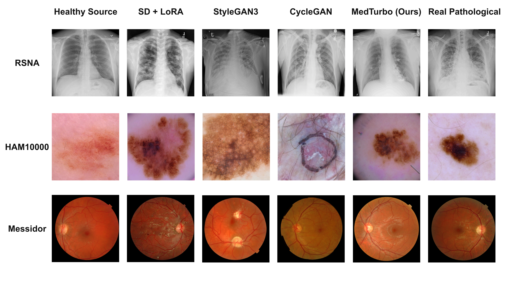

# MedTurbo: A Benchmark for Targeted Generative Attacks on Medical Image Classification

<p align="center">
  
</p>

<p align="center">
  <em>MedTurbo synthesizes localized, clinically plausible pathological findings on healthy medical images,
  exposing a targeted false-positive vulnerability in modern diagnostic classifiers — while preserving
  surrounding healthy anatomy far more faithfully than existing generative baselines.</em>
</p>

<p align="center">
  <a href="#">Paper (coming soon)</a> ·
  <a href="#release-roadmap">Release Roadmap</a> ·
  <a href="#repository-structure">Repository Structure</a> ·
  <a href="#examples">Examples</a> ·
  <a href="#citation">Citation</a>
</p>

---

## Overview

**MedTurbo** is a publicly available, cross-modality benchmark for systematically evaluating
**targeted generative attacks** on medical image classification systems. Rather than introducing
a single attack method under a task-specific setting, MedTurbo provides a standardized evaluation
platform consisting of:

- **Benchmark datasets** spanning three clinical imaging modalities — dermoscopic skin lesions
  (HAM10000), chest X-rays (RSNA), and retinal fundus photographs (Messidor);
- **A localized pathology generation framework** (the MedTurbo generator) that synthesizes
  realistic pathological findings via pseudo-paired supervision and mask-guided lesion injection;
- **Four generative attack baselines** (SD + LoRA, StyleGAN3, CycleGAN, and MedTurbo) evaluated
  against four victim classifiers (ResNet-50, EfficientNet, ViT, Swin Transformer);
- **A unified evaluation protocol** covering attack effectiveness (ASR, target-class confidence)
  and generation quality (FID, MUSIQ).

This repository accompanies our paper (currently under review). Because the paper is not yet
accepted, **this repository is released in stages** — see [Release Roadmap](#release-roadmap)
below for exactly what is available now and what follows upon acceptance.

## Release Roadmap

We are releasing this repository incrementally to allow reviewers and the community to inspect
our methodology ahead of full publication, while withholding the full training pipeline, trained
checkpoints, and the complete benchmark dataset until the paper is formally accepted.

| Component | Status | Location |
|---|---|---|
| Core generator architecture (RSNA / pneumonia) | ✅ Available now | [`medturbo_rsna/model.py`](medturbo_rsna/model.py) |
| Inference demo script (RSNA / pneumonia) | ✅ Available now | [`medturbo_rsna/inference_demo.py`](medturbo_rsna/inference_demo.py) |
| Illustrative example images (all three modalities) | ✅ Available now | [`examples/`](examples/) |
| Skin lesion (HAM10000) and fundus (Messidor) generator code | 🔒 Released upon acceptance | — |
| Full training pipeline (pseudo-source construction, losses, dataset loaders, configs) | 🔒 Released upon acceptance | — |
| Hyperparameter search / ablation configs | 🔒 Released upon acceptance | — |
| Pretrained model checkpoints (all modalities) | 🔒 Released upon acceptance | — |
| Full benchmark dataset (61,276 generated attack images) | 🔒 Released upon acceptance | — |
| Baseline implementations (SD+LoRA, StyleGAN3, CycleGAN configs) | 🔒 Released upon acceptance | — |
| Evaluation scripts (ASR, FID, MUSIQ) | 🔒 Released upon acceptance | — |

If you are a reviewer and need earlier access to any withheld component for the purpose of
review, please reach out via the contact information below.

## Repository Structure

```
MedTurbo/
├── README.md
├── LICENSE
├── examples/                     # illustrative samples only, NOT the full benchmark
│   ├── pneumonia/                #   RSNA — healthy / diseased / attacked-by-method
│   ├── skin_lesion/              #   HAM10000 — same structure
│   └── fundus/                   #   Messidor — same structure
├── assets/
│   └── examples_gallery.png
└── medturbo_rsna/                # RSNA (pneumonia) branch of the MedTurbo generator
    ├── model.py                  #   core architecture: SpatialMaskAdapter + LoRA UNet/VAE
    └── inference_demo.py         #   inference / attack-sample synthesis script
```

Only the **RSNA (pneumonia)** branch of the MedTurbo generator code is included at this stage.
The skin lesion (HAM10000) and fundus (Messidor) generator branches share the same overall
design (see the paper) and will be added to this repository upon acceptance.

> **Note:** `inference_demo.py` requires a trained checkpoint to actually run, and checkpoints
> are not yet public (see the roadmap above). It is included now so reviewers can inspect the
> inference logic and I/O format ahead of the full release.

## Examples

The [`examples/`](examples/) folder contains a small number of illustrative images per modality
— **not the full benchmark** — showing what the task and generated attack samples look like:

```
examples/
├── pneumonia/            (RSNA)
│   ├── healthy_01.jpg / healthy_02.jpg
│   ├── diseased_01.jpg / diseased_02.jpg
│   └── attacked/{SDlora,StyleGAN,CycleGAN,MedTurbo}_0X.{jpg,png}
├── skin_lesion/           (HAM10000)
│   └── (same structure)
└── fundus/                (Messidor)
    └── (same structure)
```

These example images are derived from the original public datasets — HAM10000, RSNA, and
Messidor — and are provided solely to illustrate the benchmark task. Please cite the original
data sources if you reuse them:

- **HAM10000**: Tschandl, P., Rosendahl, C. & Kittler, H. *The HAM10000 dataset, a large
  collection of multi-source dermatoscopic images of common pigmented skin lesions.* Sci. Data
  5, 180161 (2018). https://doi.org/10.1038/sdata.2018.161
- **RSNA**: Shih, G. et al. *Augmenting the National Institutes of Health chest radiograph
  dataset with expert annotations of possible pneumonia.* Radiology: Artificial Intelligence,
  1(1):e180041 (2019).
- **Messidor**: Decencière, E. et al. *Feedback on a publicly distributed database: the Messidor
  database.* Image Analysis & Stereology, 33(3):231–234 (2014).

## Installation

```bash
git clone https://github.com/<your-org>/MedTurbo.git
cd MedTurbo
conda create -n medturbo python=3.10 -y
conda activate medturbo
pip install -r requirements.txt
```

> The currently released code covers the RSNA generator architecture and inference script only.
> The full environment specification will be documented in detail with the full code release.

## Citation

If you find this repository or the MedTurbo benchmark useful for your research, please consider
citing our paper once it is publicly available. A BibTeX entry will be added here upon
publication.

```bibtex
@article{medturbo2026,
  title   = {MedTurbo: A Benchmark for Targeted Generative Attacks on Medical Image Classification},
  author  = {Sun, Liang and Cai, Shuaiji and Zhang, Li and Zhang, Daoqiang},
  journal = {TBD},
  year    = {2026},
  note    = {Preprint / under review}
}
```

## Ethical Use Statement

MedTurbo is released strictly for **defensive security research** — to help the community
evaluate, understand, and ultimately harden medical diagnostic AI systems against targeted
generative manipulation. It is **not** intended to facilitate real-world misuse such as insurance
fraud or falsified diagnostic evidence. Access to trained checkpoints and full attack code will
be gated behind a research-use agreement upon release; see the roadmap above for details.

## License

The code in this repository is released under the [MIT License](LICENSE) (or your preferred
license — to be finalized). Please note that the source medical imaging datasets referenced above
retain their own, separate licenses.

## Contact

For questions about this repository, or reviewer requests for early access to withheld
components, please open a GitHub issue or contact the corresponding author at
`dqzhang@nuaa.edu.cn`.
